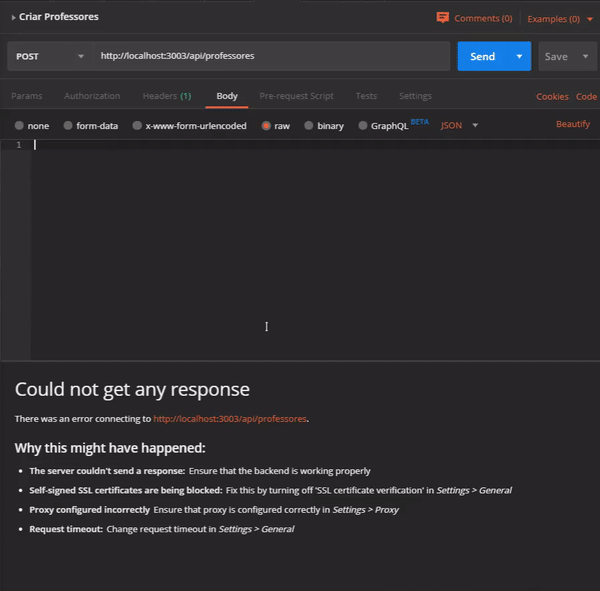
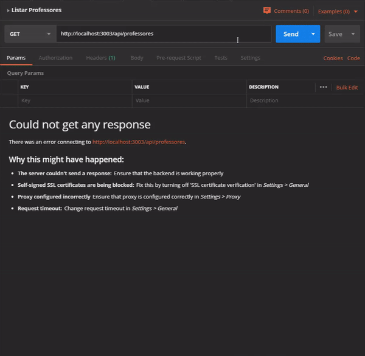

# Colmeia_Test_Backend

### Passos para execução

### 1) Clonar repositório do projeto **_backend_**

```bash
$ git clone https://github.com/brunnooliver7/Colmeia_Test_Backend
```
### 2) Entrar na pasta do projeto **_backend_**

```bash
$ cd backend
```

### 3) Instalar as dependências do projeto **_backend_**

```bash
$ npm i
```

### 4) Executar a conexão com o banco de dados

```bash
$ mongod
```

### 5) Executar a aplicação

```bash
$ npm run dev
```

Se a aplicação executar de forma correta, você deve receber a seguinte resposta:

```bash
BACKEND is running on port 3003
```

### 6) Realizar cadastros

Utilize o programa Postman (https://www.getpostman.com) para realizar o cadastro dos professores com o comando POST

Lembre-se de utilizar a seguinte URL: http://localhost:3003/api/professores

Para relizar alguns testes, você pode utilizar os cadastros que estão salvos no arquivo **_DadosProfessores.json_** da pasta **_assets_**




### 7) Realizar buscas

Verifique se os cadastros foram salvos no banco de dados através do comando GET


